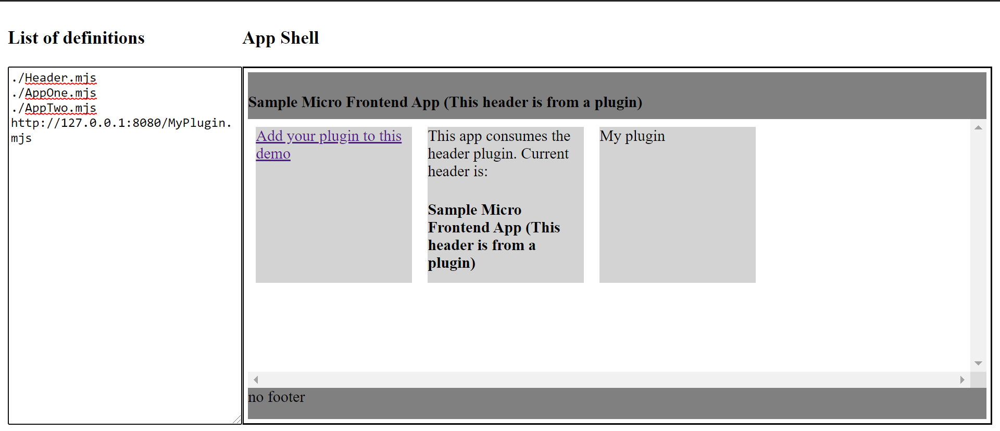

# A sample react plugin template for svc-pool

1. Clone template

```
git clone git@github.com:svc-pool/react-plugin-template.git
```

2. Install yarn & modules

```
npm i -g yarn
```

3. Install modules

```
cd react-plugin-template
yarn install
```

4. Start development environment

```
yarn dev
```

6. Add plugin to demo shell

- Open shell demo at [here](https://svc-pool.github.io/demo-react-shell/)

- Add plugin to definitions list of demo shell. Default is:

```
http://127.0.0.1:8080/MyPlugin.mjs
```


7. Start edit plugin as your wish
